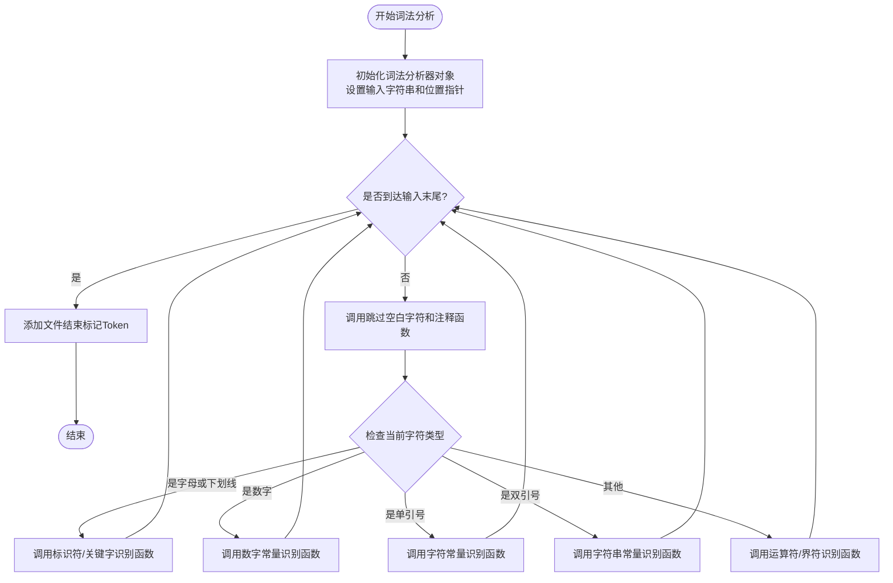
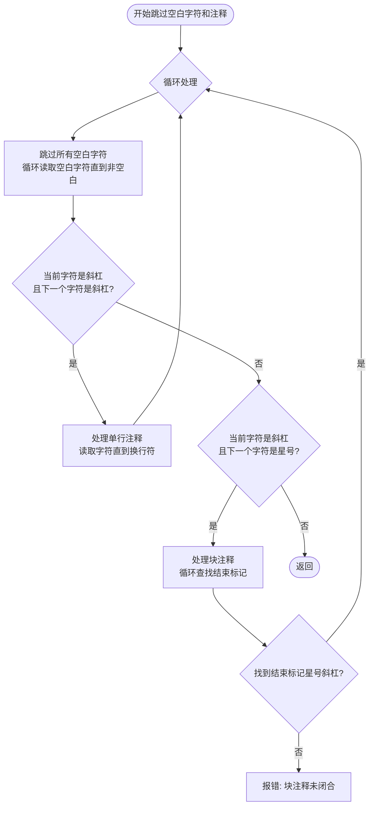
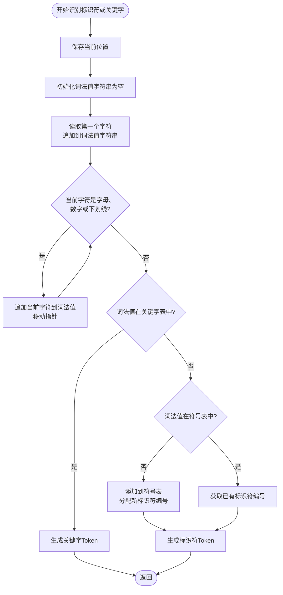
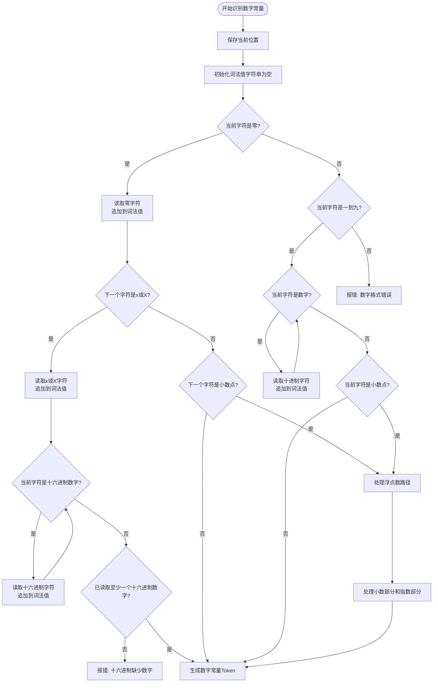
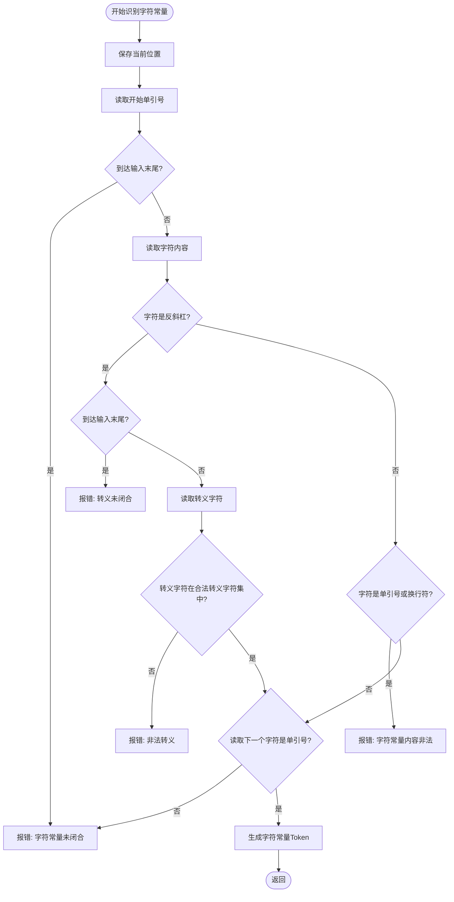
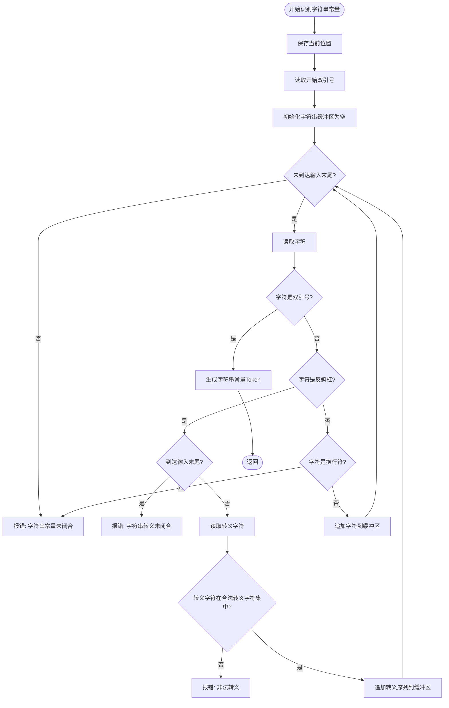
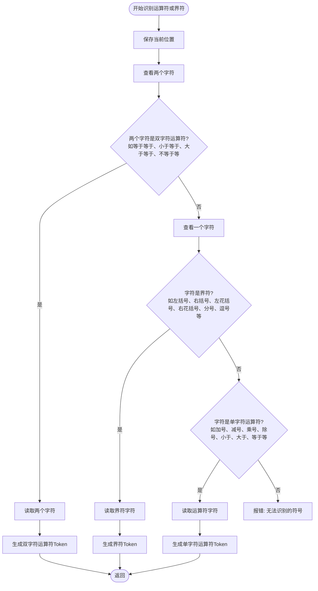

# -CF-OF-
1.无符号数：CF为cary flag进位/借位标记，当2个数相加产生了进位时或2个数相减产生了借位时，CF=1

2.有符号数：OF为overflow flag溢出标记，当运算结果result溢出时，OF=1；未溢出时，OF=0
OF的计算方法：

注：从图形上理解，为什么原码数值相加有进位，补码数值相加就没有进位：两个数原码相加大于360度，两个原码、补码相加一共720度，那么两个补码相加一定小于360度

 # 3.1 词法分析方法流程图

## 3.1.2 主控流程图

## 3.1.4 空白字符和注释处理流程图

## 3.1.6 标识符和关键字识别流程图

## 3.1.8 数字常量识别流程图

## 3.1.10 字符常量识别流程图

## 3.1.12 字符串常量识别流程图

## 3.1.14 运算符和界符识别流程图

