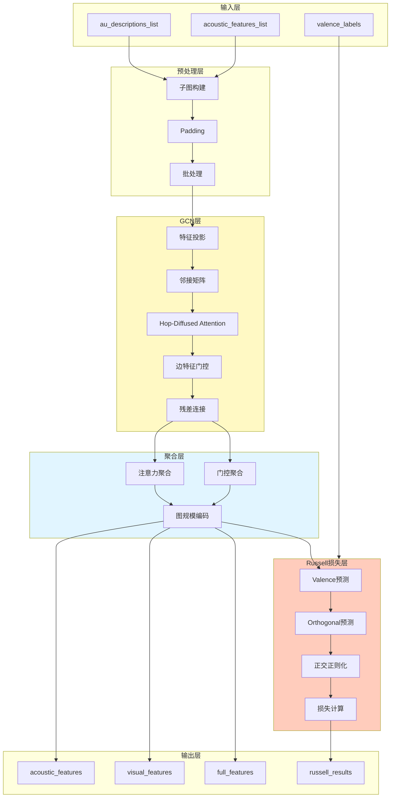

# -CF-OF-
1.无符号数：CF为cary flag进位/借位标记，当2个数相加产生了进位时或2个数相减产生了借位时，CF=1


2.有符号数：OF为overflow flag溢出标记，当运算结果result溢出时，OF=1；未溢出时，OF=0
OF的计算方法：


注：从图形上理解，为什么原码数值相加有进位，补码数值相加就没有进位：两个数原码相加大于360度，两个原码、补码相加一共720度，那么两个补码相加一定小于360度


# 心理学GNN模块 - Mermaid流程图

## 完整流程图

```mermaid
flowchart TD
    Start([输入: au_descriptions_list<br/>acoustic_features_list<br/>valence_labels]) --> M1[模块1: 子图构建]
    
    M1 --> |提取节点索引| M1A[获取present_nodes]
    M1A --> |提取特征| M1B[node_features: [subgraph_nodes, 8, 4096]<br/>edge_features: [subgraph_nodes, subgraph_nodes, 64]]
    
    M1B --> M2[模块2: Padding与批处理]
    M2 --> |找到max_nodes| M2A[Padding到max_nodes]
    M2A --> |创建mask| M2B[batch_node_features: [batch_size, max_nodes, 8, 4096]<br/>batch_edge_features: [batch_size, max_nodes, max_nodes, 64]<br/>batch_node_masks: [batch_size, max_nodes]]
    
    M2B --> M3[模块3: 节点特征投影]
    M3 --> |Linear投影| M3A[projected: [batch_size, max_nodes, 8, 128]]
    
    M3A --> M4[模块4: 构建邻接矩阵]
    M4 --> |提取边强度| M4A[edge_strength: [batch_size, max_nodes, max_nodes]]
    M4A --> |计算掩码| M4B[adjacency_mask: [batch_size, max_nodes, max_nodes]]
    M4B --> |添加自环| M4C[adjacency_mask with self-loops]
    
    M4C --> M5[模块5: Hop-Diffused Attention]
    M5 --> |转置| M5A[projected: [batch_size, 8, max_nodes, 128]]
    M5A --> |计算注意力| M5B[A_base: [batch_size, max_nodes, max_nodes]]
    M5B --> |应用掩码| M5C[归一化A_base]
    M5C --> |多跳扩散| M5D[A_diffused = Σ θ_k * A^k<br/>θ_k = α * (1-α)^k]
    M5D --> |更新特征| M5E[structural_features: [batch_size, max_nodes, 8, 128]]
    
    M5E --> M6[模块6: 边特征门控]
    M6 --> |边特征投影| M6A[edge_proj: [batch_size, max_nodes, max_nodes, 128]]
    M6A --> |门控计算| M6B[gate_weights: [batch_size, max_nodes, max_nodes, 128]]
    M6B --> |应用门控| M6C[gated_edge_feat]
    M6C --> |聚合邻居| M6D[neighbor_agg: [batch_size, max_nodes, 128]]
    M6D --> |融合特征| M6E[updated_features: [batch_size, max_nodes, 8, 128]]
    
    M6E --> M7[模块7: 残差连接与归一化]
    M7 --> |残差连接| M7A[projected + updated_features]
    M7A --> |LayerNorm| M7B[归一化特征]
    M7B --> |Dropout| M7C[batch_updated_features: [batch_size, max_nodes, 8, 128]]
    
    M7C --> M8[模块8: 子图特征聚合]
    M8 --> |对每个样本| M8A[updated_features: [max_nodes, 8, 128]]
    M8A --> |注意力聚合| M8B[attn_agg: [128]]
    M8A --> |门控聚合| M8C[gate_agg: [128]]
    M8B --> |融合| M8D[combined: [256]]
    M8C --> |融合| M8D
    M8D --> |图规模编码| M8E[fused: [128]]
    M8E --> |堆叠| M8F[acoustic_features: [batch_size, 8, 128]<br/>visual_features: [batch_size, 8, 128]<br/>full_features: [batch_size, 8, 128]]
    
    M8F --> M9{是否计算<br/>Russell损失?}
    M9 -->|是| M10[模块9: Valence预测]
    M9 -->|否| End1([输出: 三种子图特征])
    
    M10 --> |注意力分数| M10A[valence_attn_weights: [batch_size, 8, 1]]
    M10A --> |Softmax| M10B[归一化权重: [batch_size, 8]]
    M10B --> |加权聚合| M10C[weighted_valence: [batch_size, 128]]
    M10C --> |特征聚合| M10D[aggregated_valence: [batch_size, 128]]
    M10D --> |预测| M10E[valence_pred: [batch_size], [-3, 3]]
    
    M10E --> M11[模块10: Orthogonal Dimension预测]
    M11 --> |注意力分数| M11A[orth_attn_weights: [batch_size, 8, 1]]
    M11A --> |Softmax| M11B[归一化权重: [batch_size, 8]]
    M11B --> |加权聚合| M11C[weighted_orth: [batch_size, 128]]
    M11C --> |特征聚合| M11D[aggregated_orth: [batch_size, 128]]
    M11D --> |预测| M11E[orth_pred: [batch_size], [0, 1]]
    
    M11E --> M12[模块11: 正交正则化]
    M12 --> |特征提取| M12A[valence_features: [batch_size, 32]<br/>orth_features: [batch_size, 32]]
    M12A --> |余弦相似度| M12B[cos_sim: [batch_size]]
    M12B --> |正交损失| M12C[orthogonality: scalar]
    
    M12C --> M13[模块12: 总损失计算]
    M13 --> |MSE损失| M13A[valence_supervised: scalar]
    M13A --> |总损失| M13B[total = valence_supervised + 0.1 * orthogonality]
    
    M13B --> End2([输出: 三种子图特征<br/>+ Russell损失结果])
    
    style Start fill:#e1f5ff
    style End1 fill:#c8e6c9
    style End2 fill:#c8e6c9
    style M5 fill:#fff9c4
    style M6 fill:#fff9c4
    style M10 fill:#ffccbc
    style M11 fill:#ffccbc
    style M12 fill:#ffccbc
    style M13 fill:#ffccbc
```

---

## GCN层详细流程图

```mermaid
flowchart LR
    A[节点特征投影<br/>[batch, max_nodes, 8, 4096]] --> B[projected<br/>[batch, max_nodes, 8, 128]]
    
    C[边特征<br/>[batch, max_nodes, max_nodes, 64]] --> D[构建邻接矩阵<br/>adjacency_mask<br/>[batch, max_nodes, max_nodes]]
    
    B --> E[Hop-Diffused Attention]
    D --> E
    E --> F[structural_features<br/>[batch, max_nodes, 8, 128]]
    
    F --> G[边特征门控]
    C --> G
    G --> H[updated_features<br/>[batch, max_nodes, 8, 128]]
    
    B --> I[残差连接]
    H --> I
    I --> J[LayerNorm + Dropout]
    J --> K[batch_updated_features<br/>[batch, max_nodes, 8, 128]]
    
    style E fill:#fff9c4
    style G fill:#fff9c4
    style I fill:#e1f5ff
```

---

## Hop-Diffused Attention详细流程

```mermaid
flowchart TD
    A[projected<br/>[batch, max_nodes, 8, 128]] --> B[转置<br/>[batch, 8, max_nodes, 128]]
    
    B --> C{对每个token位置}
    C --> D[token_features<br/>[batch, max_nodes, 128]]
    
    D --> E[计算自注意力]
    E --> F[A_base<br/>[batch, max_nodes, max_nodes]]
    
    G[adjacency_mask<br/>[batch, max_nodes, max_nodes]] --> H[应用掩码]
    F --> H
    H --> I[归一化A_base]
    
    I --> J[多跳扩散]
    J --> K[A_power = eye<br/>初始单位矩阵]
    K --> L[for k in range(max_hop+1)]
    L --> M[A_diffused += θ_k * A_power<br/>θ_k = α * (1-α)^k]
    M --> N[A_power = bmm(A_power, A_base)]
    N --> L
    L --> O[A_diffused<br/>[batch, max_nodes, max_nodes]]
    
    D --> P[应用扩散矩阵]
    O --> P
    P --> Q[diffused_features<br/>[batch, max_nodes, 128]]
    
    Q --> R[堆叠所有token]
    R --> S[structural_features<br/>[batch, max_nodes, 8, 128]]
    
    style J fill:#fff9c4
    style M fill:#ffccbc
```

---

## 子图特征聚合详细流程

```mermaid
flowchart TD
    A[batch_updated_features<br/>[batch, max_nodes, 8, 128]] --> B[对每个样本]
    B --> C[updated_features<br/>[max_nodes, 8, 128]]
    
    C --> D[对每个token位置]
    D --> E[token_features<br/>[max_nodes, 128]]
    
    E --> F[应用mask]
    F --> G[masked_features<br/>[num_real_nodes, 128]]
    
    G --> H[注意力聚合]
    G --> I[门控聚合]
    
    H --> J[attn_scores = attn_out(tanh(attn_hidden))]
    J --> K[attn_weights = softmax(attn_scores)]
    K --> L[attn_agg = sum(masked_features * attn_weights)]
    
    I --> M[gate_scores = sigmoid(gate_out(tanh(gate_hidden)))]
    M --> N[gate_agg = mean(masked_features * gate_scores)]
    
    L --> O[融合]
    N --> O
    O --> P[combined = cat([attn_agg, gate_agg])<br/>[256]]
    
    P --> Q[图规模编码]
    Q --> R[size_weight = sigmoid(mlp(num_real_nodes / total_nodes))]
    
    P --> S[readout_projector]
    S --> T[fused = readout_projector(combined)<br/>[128]]
    
    T --> U[fused = fused * size_weight]
    R --> U
    U --> V[fused: [128]]
    
    V --> W[堆叠所有token]
    W --> X[subgraph_feature<br/>[8, 128]]
    
    X --> Y[堆叠所有样本]
    Y --> Z[acoustic_features: [batch, 8, 128]<br/>visual_features: [batch, 8, 128]<br/>full_features: [batch, 8, 128]]
    
    style H fill:#fff9c4
    style I fill:#fff9c4
    style Q fill:#e1f5ff
```

---

## Russell损失计算详细流程

```mermaid
flowchart TD
    A[subgraph_features<br/>[batch, 8, 128]] --> B[Valence预测路径]
    C[acoustic_subgraph_features<br/>[batch, 8, 128]] --> D[Orthogonal Dimension预测路径]
    
    B --> E[valence_attention]
    E --> F[valence_attn_weights: [batch, 8, 1]]
    F --> G[softmax归一化]
    G --> H[weighted_valence: [batch, 128]]
    H --> I[valence_aggregation]
    I --> J[aggregated_valence: [batch, 128]]
    J --> K[valence_predictor]
    K --> L[valence_pred: [batch], [-3, 3]]
    
    D --> M[orth_attention]
    M --> N[orth_attn_weights: [batch, 8, 1]]
    N --> O[softmax归一化]
    O --> P[weighted_orth: [batch, 128]]
    P --> Q[orth_aggregation]
    Q --> R[aggregated_orth: [batch, 128]]
    R --> S[orth_predictor]
    S --> T[orth_pred: [batch], [0, 1]]
    
    J --> U[特征提取]
    R --> U
    U --> V[valence_features: [batch, 32]<br/>orth_features: [batch, 32]]
    
    V --> W[余弦相似度]
    W --> X[cos_sim: [batch]]
    X --> Y[orthogonality = mean(cos_sim²)]
    
    L --> Z[valence_supervised = MSE(valence_pred, labels)]
    Y --> AA[总损失计算]
    Z --> AA
    AA --> AB[total = valence_supervised + 0.1 * orthogonality]
    
    style B fill:#ffccbc
    style D fill:#ffccbc
    style W fill:#fff9c4
    style AA fill:#c8e6c9
```

---

## 数据流概览图



---

## 使用说明

这些Mermaid流程图可以在以下环境中查看和编辑：

1. **GitHub/GitLab**: 直接在Markdown文件中渲染
2. **VS Code**: 安装 "Markdown Preview Mermaid Support" 扩展
3. **在线编辑器**: https://mermaid.live/
4. **Notion/Obsidian**: 支持Mermaid语法

### 流程图说明

- **完整流程图**: 展示从输入到输出的完整流程
- **GCN层详细流程**: GCN层的内部处理步骤
- **Hop-Diffused Attention详细流程**: 多跳扩散的具体实现
- **子图特征聚合详细流程**: 如何将节点特征聚合为子图特征
- **Russell损失计算详细流程**: Russell损失的计算过程
- **数据流概览图**: 整体架构的层次结构

