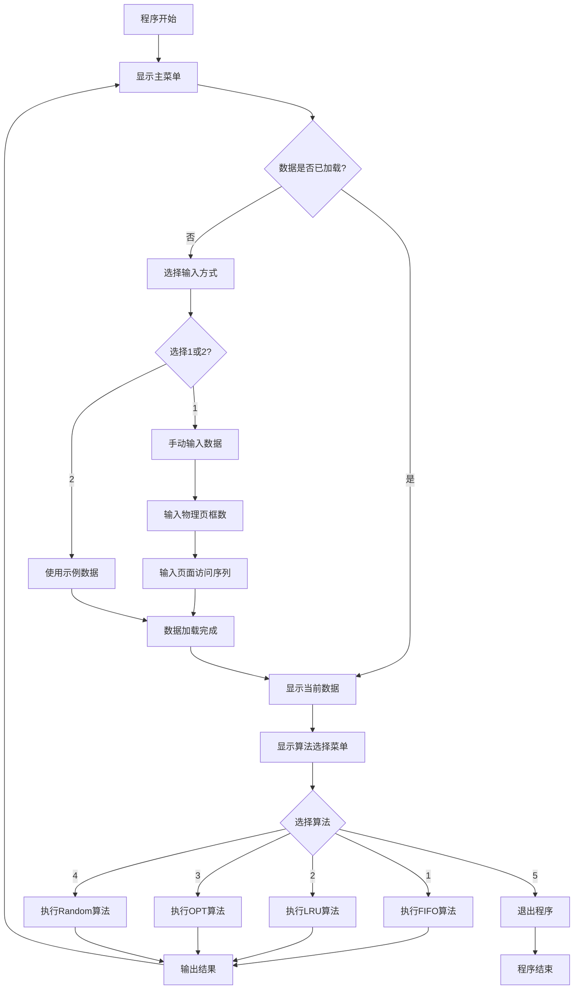
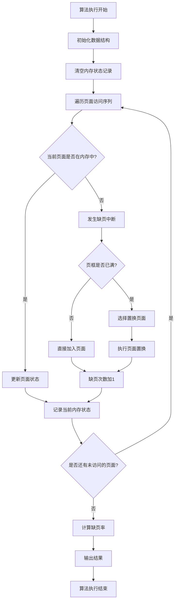
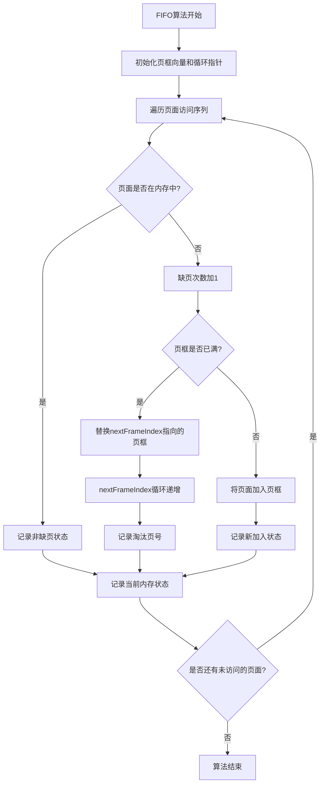
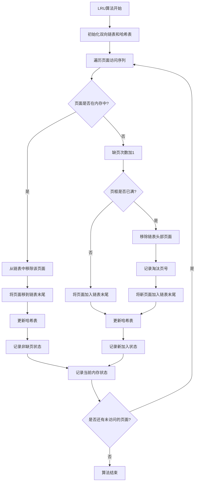
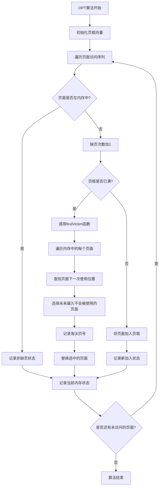
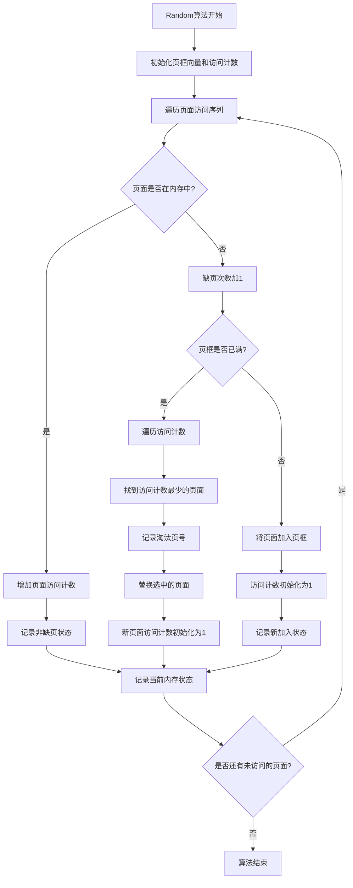
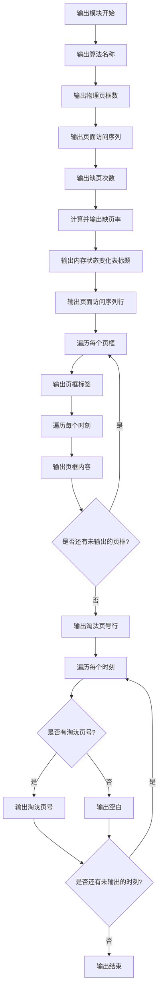

# -CF-OF-
1.无符号数：CF为cary flag进位/借位标记，当2个数相加产生了进位时或2个数相减产生了借位时，CF=1

2.有符号数：OF为overflow flag溢出标记，当运算结果result溢出时，OF=1；未溢出时，OF=0
OF的计算方法：

注：从图形上理解，为什么原码数值相加有进位，补码数值相加就没有进位：两个数原码相加大于360度，两个原码、补码相加一共720度，那么两个补码相加一定小于360度

3 功能设计流程图

3.1 程序主流程图

程序主流程图描述了从程序启动到退出的完整流程。程序采用循环菜单结构，用户首先需要选择输入方式（手动输入或使用示例数据），然后可以反复选择不同的算法执行，每次执行完成后返回主菜单，方便用户对比不同算法的性能。流程图中的菱形节点表示判断条件，矩形节点表示处理步骤，箭头上的标签表示条件分支。

3.2 算法执行流程图

算法执行流程图描述了页面置换算法的通用执行流程，适用于所有四种算法。流程从初始化开始，然后遍历页面访问序列。对于每个页面，首先检查是否已在内存中，如果在则更新状态，如果不在则发生缺页中断。缺页时根据页框是否已满决定直接加入还是执行置换。每处理完一个页面后记录当前内存状态，直到所有页面处理完成，最后计算缺页率并输出结果。

3.3 FIFO算法流程图

FIFO算法流程图展示了先进先出算法的具体执行过程。算法使用循环队列的思想，维护一个nextFrameIndex指针指向下一个要替换的页框。当发生缺页且页框已满时，替换nextFrameIndex指向的页框，然后将nextFrameIndex循环递增。这样保证了最早进入内存的页面最先被替换，符合FIFO策略。流程图清晰地展示了页面检查、缺页处理、循环指针更新和状态记录的完整过程。

3.4 LRU算法流程图

LRU算法流程图展示了最近最久未使用算法的具体执行过程。算法使用双向链表维护页框，链表头部是最久未使用的页面，链表尾部是最近使用的页面。当页面被访问时，如果已在内存中，则将其从链表中移除并移到链表末尾，标记为最近使用。当发生缺页且页框已满时，移除链表头部的页面（最久未使用），将新页面加入链表末尾。哈希表用于快速查找页面在链表中的位置，实现O(1)的更新操作。流程图详细展示了链表维护、哈希表更新和页面置换的完整逻辑。

3.5 OPT算法流程图

OPT算法流程图展示了理想型淘汰算法的具体执行过程。OPT算法需要预知未来的页面访问序列，选择未来最久不会被使用的页面进行置换。当发生缺页且页框已满时，算法调用findVictim函数，该函数遍历内存中的每个页面，在未来的访问序列中查找它下一次被使用的位置。如果某个页面永远不会再被使用，优先选择它；否则，选择未来最久不会被使用的页面（即下一次使用位置最远的页面）。流程图展示了未来序列查找和最优页面选择的完整过程，这是OPT算法实现理论最优性能的关键步骤。

3.6 Random算法流程图

Random算法流程图展示了随机淘汰算法的具体执行过程。本实验实现的Random算法并非真正的随机，而是基于访问频率的策略：每次淘汰被访问概率最低的页面（访问次数最少的页面）。算法维护每个页面的访问计数，当页面被访问时，如果已在内存中，则增加其访问计数。当发生缺页且页框已满时，遍历访问计数，找到访问计数最少的页面进行置换。新加入的页面访问计数初始化为1。流程图展示了访问计数维护、最少访问页面查找和页面置换的完整过程，体现了基于访问频率的置换策略。

3.7 输出模块流程图

输出模块流程图描述了结果输出的详细过程。输出分为三个部分：基本信息输出、内存状态变化表输出和淘汰页号输出。基本信息包括算法名称、物理页框数、页面访问序列、缺页次数和缺页率。内存状态变化表首先输出页面访问序列行，然后遍历每个页框，输出每个页框在不同时刻的内容，确保列对齐。最后输出淘汰页号行，对于每个时刻，如果有淘汰页号则输出，否则输出空白。流程图展示了格式化输出的完整过程，包括标签宽度计算、列对齐处理和表格格式控制，确保输出结果清晰易读。
