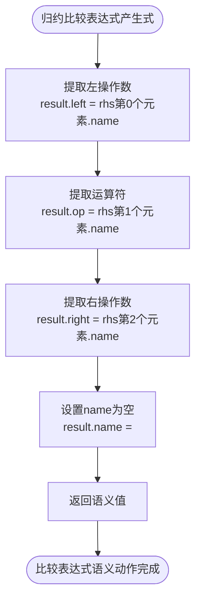

# -CF-OF-
1.无符号数：CF为cary flag进位/借位标记，当2个数相加产生了进位时或2个数相减产生了借位时，CF=1


2.有符号数：OF为overflow flag溢出标记，当运算结果result溢出时，OF=1；未溢出时，OF=0
OF的计算方法：


注：从图形上理解，为什么原码数值相加有进位，补码数值相加就没有进位：两个数原码相加大于360度，两个原码、补码相加一共720度，那么两个补码相加一定小于360度


# 3.3 语义分析方法流程图

## 3.3.2 语义动作执行流程图

```mermaid
flowchart TD
    开始([开始执行语义动作]) --> 获取产生式[获取产生式信息]
    获取产生式 --> 检查语义动作{产生式有语义动作?}
    检查语义动作 -->|否| 直接传递[直接传递第一个子节点属性值<br/>newVal = rhsVals第0个元素]
    检查语义动作 -->|是| 调用语义函数[调用语义动作函数<br/>newVal = semanticAction(rhsVals)]
    调用语义函数 --> 提取属性值[从rhsVals中提取子节点属性值]
    提取属性值 --> 计算属性值[计算父节点的属性值]
    计算属性值 --> 生成中间代码[生成中间代码四元式]
    生成中间代码 --> 返回结果[返回新的语义值]
    直接传递 --> 返回结果
    返回结果 --> 结束([语义动作执行完成])
```

## 3.3.3 属性值传递流程图


## 3.3.4 中间代码生成流程图


## 3.3.5 临时变量生成流程图

```mermaid
flowchart TD
    开始([需要生成临时变量]) --> 增加计数器[tempCount++]
    增加计数器 --> 生成变量名[生成变量名<br/>name = "t" + to_string(tempCount)]
    生成变量名 --> 返回变量名[返回临时变量名]
    返回变量名 --> 结束([临时变量生成完成])
```

## 3.3.6 赋值语句语义动作流程图


## 3.3.7 算术表达式语义动作流程图


## 3.3.8 比较表达式语义动作流程图



## 3.3.9 DO-WHILE语句语义动作流程图


